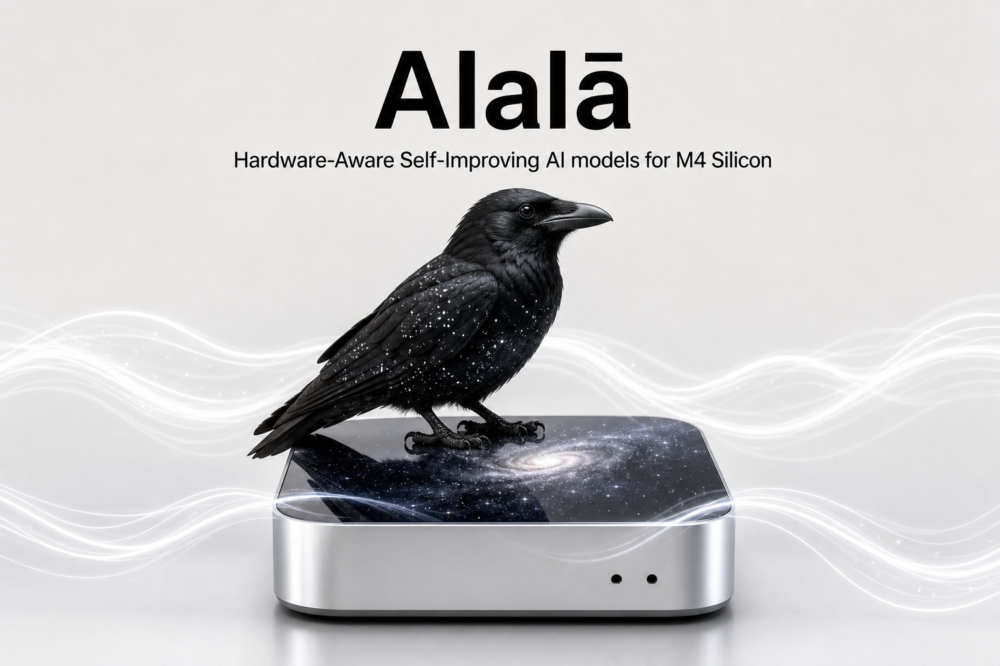

<p align="center">
  
</p>

<h1 align="center">Alalā</h1>

<p align="center">
  <strong>Physics-first, measurement-driven AI for Apple Silicon M4 — maximizing Intelligence per Joule (IPJ).</strong>
</p>

<p align="center">
  <a href="LICENSE"></a>
  <a href="https://github.com/humananalog/alala"></a>
  <a href="https://www.python.org/downloads/"></a>
  
</p>

---

## About

**Alalā** is an open-source research and systems project building hardware-aware AI on Apple Silicon. The north star is **Intelligence per Joule (IPJ)**: useful intelligence delivered per unit of energy, measured on real hardware — not estimated from FLOPs or peak throughput.

The project co-designs model architecture, compiler/runtime, and memory hierarchy around physical constraints on the Mac Mini M4 (24 GB unified memory): ANE residency, SRAM limits (~28–30 MB working sets), thermal headroom, and orchestration overhead. Self-improvement loops are bounded by measurable IPJ gains and the **Human Cooperation Attractor (HCA)** — a constitutional constraint on what the system may optimize.

**Current status:** Phase 0 is **complete**. The M4 measurement harness is implemented, validated on physical silicon, and backed by raw `powermetrics` logs and JSONL artifacts in `logs/` and `results/`.

## Phase 0 Highlights

Measured on Mac Mini M4 24 GB (see [`docs/Phase0_Results_Summary_Alalā.md`](docs/Phase0_Results_Summary_Alalā.md)):

| Metric | Result |
|--------|--------|
| SRAM cliff \(L_{\text{cliff}}\) | **1024** context tokens (33.7% sustained throughput drop) |
| Thermal steady state | **~82.7 °C** under sustained decode load |
| Orchestration overhead | **3.7–4.3%** of total energy (Python-style dispatch) |
| int4 KV dequant cost | **+5.55 J** (~0.5% overhead; ΔIPJ ≈ −0.0028 vs FP16) |
| Safe sustained envelope | **≤ 85 °C** with active thermal monitoring |

These numbers gate all architectural decisions. No performance claim is accepted without attached `powermetrics` + thermal data per the [IPJ Measurement Protocol](docs/IPJ_Measurement_Protocol_Alalā.md).

## Features

- **M4 energy harness** — `harness/m4_energy_harness.py` with four benchmark modes: `thermal_baseline`, `sram_cliff`, `kv_comparison`, `orchestration`
- **IPJ-first logging** — structured JSONL + raw `powermetrics` artifacts per experiment
- **20 authoritative docs** — physics foundation, HCA spec, memory architecture, compiler skeleton, experimentation framework, and Phase 0/1 roadmap
- **AI-native workflow** — `AGENTS.md`, Cursor rules, and explicit task lists for agent-driven development on physical M4 hardware
- **Reproducible artifacts** — benchmark logs and results tracked in-repo for audit and comparison

## Requirements

| Requirement | Notes |
|-------------|-------|
| **Hardware** | Physical **Mac Mini M4, 24 GB** unified memory (no cloud/simulated substitutes for benchmarks) |
| **OS** | macOS with `powermetrics` access (typically requires `sudo`) |
| **Python** | 3.11+ |
| **Dependencies** | `numpy` (required); `matplotlib` (optional, for plots); MLX stack for decode workloads |
| **Secrets** | Optional `.env` with `SUDO_PASSWORD` and `MLX_PYTHON` (see [Harness README](harness/README.md)) |

## Quick Start

```bash
git clone https://github.com/humananalog/alala.git
cd alala

# Verify repository structure and documentation
./verify.sh

# Inspect harness options (run benchmarks on physical M4 only)
python harness/m4_energy_harness.py --help
```

### Run a benchmark (M4 hardware)

Allow the machine to idle **10+ minutes** before measuring. All modes emit raw `powermetrics` logs to `logs/` and summaries to `results/`.

```bash
# Thermal baseline — establish power curve and safe sustained envelope
python harness/m4_energy_harness.py --mode thermal_baseline --duration 600 --idle-seconds 60

# SRAM cliff — sweep context lengths to find L_cliff
python harness/m4_energy_harness.py --mode sram_cliff --model baseline --max-context 8192

# KV comparison — FP16 vs int4 including dequant energy
python harness/m4_energy_harness.py --mode kv_comparison --context 512 --iterations 3

# Orchestration — CPU dispatch overhead vs tight MLX loop
python harness/m4_energy_harness.py --mode orchestration --context 512 --iterations 3
```

Full step-by-step instructions: [`docs/How_to_Run_First_Micro_Benchmark_on_M4_Alalā.md`](docs/How_to_Run_First_Micro_Benchmark_on_M4_Alalā.md).

## Project Structure

```text
alala/
├── AGENTS.md              # Instructions for Cursor / cloud AI coding agents
├── assets/                # README and project assets
├── docs/                  # Authoritative documentation (20 indexed docs)
├── harness/               # Phase 0 M4 measurement harness
├── experiments/           # Experiment scripts and configs
├── logs/                  # JSONL + powermetrics experiment logs
├── results/               # Benchmark outputs per run
├── checkpoints/           # Rollback checkpoints (contents gitignored)
├── verify.sh              # Pre-commit verification — run before every commit
└── VERSION                # Repository version
```

## Documentation

Start at the [Project Index](docs/Project_Index_Alalā.md) — the navigation hub for the full doc set.

| Topic | Document |
|-------|----------|
| Navigation hub | [`docs/Project_Index_Alalā.md`](docs/Project_Index_Alalā.md) |
| Live program status | [`docs/OSLab_Program_Board.md`](docs/OSLab_Program_Board.md) |
| Phase 0 measured results | [`docs/Phase0_Results_Summary_Alalā.md`](docs/Phase0_Results_Summary_Alalā.md) |
| IPJ measurement protocol | [`docs/IPJ_Measurement_Protocol_Alalā.md`](docs/IPJ_Measurement_Protocol_Alalā.md) |
| Physics & M4 constraints | [`docs/Alalā_Physics_Corrected_Foundation.md`](docs/Alalā_Physics_Corrected_Foundation.md) |
| HCA constitutional spec | [`docs/Alalā_Core_Invariant_Specification_HCA.md`](docs/Alalā_Core_Invariant_Specification_HCA.md) |
| AI coder rules | [`docs/AI_Coder_Rules_Guidelines_Alalā.md`](docs/AI_Coder_Rules_Guidelines_Alalā.md) |
| Harness reference | [`harness/README.md`](harness/README.md) |

## Core Principles

- **Physics first** — data movement, SRAM budgeting, thermal headroom, and ANE efficiency are first-class constraints
- **Measurement-driven** — decisions gated by real hardware measurements (IPJ, utilization, energy)
- **Bounded self-improvement** — improvement loops require measurable IPJ gains and HCA compliance
- **ANE-first routing** — compute-bound ops default to ANE; orchestration overhead is measured, not assumed

## Roadmap

| Phase | Focus | Status |
|-------|-------|--------|
| **Phase 0** | ANE characterization & measurement infrastructure | **Complete** |
| **Phase 1** | ANE residency (>60% utilization target), safe operating region, first IPJ-gated self-improvement scaffold | Next |

Phase 1 entry criteria and measured constraints: [`docs/Phase0_Results_Summary_Alalā.md`](docs/Phase0_Results_Summary_Alalā.md) §Phase 1 Entry Criteria.

## Contributing

Contributions are welcome. This repository is designed for both human and AI agent contributors working against explicit specs.

1. Read [`AGENTS.md`](AGENTS.md) and [`docs/AI_Coder_Rules_Guidelines_Alalā.md`](docs/AI_Coder_Rules_Guidelines_Alalā.md)
2. Check [`docs/OSLab_Program_Board.md`](docs/OSLab_Program_Board.md) for current phase, tasks, and blockers
3. Make focused, minimal diffs — match existing naming and patterns
4. Run `./verify.sh` before every commit (must pass)
5. Include measurement artifacts (`logs/`, `results/`) with harness or benchmark changes
6. No placeholder stubs, no unmeasured performance claims

For architectural changes or >10% IPJ impact, update the Program Board and open a discussion before merging.

## Authors

- **[Human Analog Ltd](https://github.com/humananalog)**
- **Lucius Stel**

## License

[Apache License 2.0](LICENSE) — Copyright Human Analog Ltd.

---

<p align="center"><em>Built on physical Apple Silicon. Every joule counted.</em></p>
