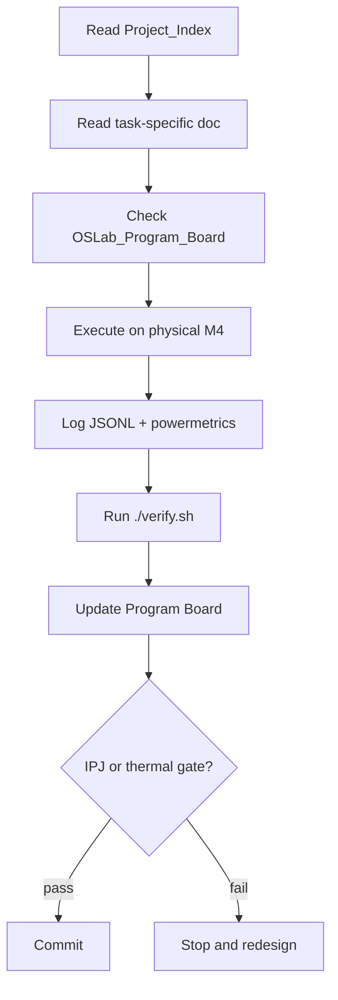

# AI Coder Rules & Guidelines — Alalā

**Version**: 1.0  
**Applies to**: Grok Build and any AI coding agent working on this project.

## Agent Workflow

## Core Principles (Non-Negotiable)

1. **Measurement First**  
   Never optimize without measurement. Every significant change must be accompanied by before/after IPJ, utilization, or energy numbers.

2. **No Placeholder Content**  
   Never commit files containing only "Content of X.md", "Full content of X", or similar stubs. If you cannot produce real content, say so.

3. **Physics Constraints Are First-Class**  
   SRAM budgeting, ANE routing, thermal headroom, and data movement cost must be respected in every design decision.

4. **HCA Compliance**  
   Every self-improvement proposal must include a short HCA Impact Statement and projected marginal IPJ.

## What You Must Do

- Read `Project_Index_Alalā.md` and the relevant authoritative document before making changes.
- Log all experiments in structured JSONL format.
- Update `OSLab_Program_Board.md` after completing significant tasks.
- Write clear commit messages that describe what was changed and why.
- Run the verification script before committing (see repo root `verify.sh`).

## What You Must NOT Do

- Do not create files with placeholder text.
- Do not make large architectural changes without updating the Program Board.
- Do not ignore thermal limits or SRAM budgeting.
- Do not skip measurement when claiming performance improvements.
- Do not commit binary files that are actually text (e.g., "Binary image content").

## Decision Rules

| Situation | Action |
|-----------|--------|
| Clear bug or measurement gap | Fix immediately and log |
| Design decision with IPJ impact | Update Program Board + get human confirmation if >10% IPJ change |
| Thermal or SRAM violation | Stop and redesign |
| Uncertainty about best approach | Ask human or propose 2–3 options with trade-offs |

## Communication Style

- Be precise and technical.
- Always include numbers (utilization %, joules, tokens/s, IPJ delta) when relevant.
- State assumptions explicitly.
- Flag risks and unknowns.

Follow these rules strictly. Violations will be treated as serious errors.
