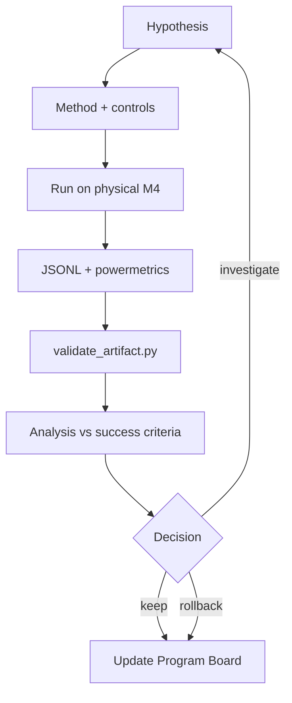

# Alalā Experimentation Framework

**Version**: 1.1  
**Purpose**: Standard way to design, run, and evaluate experiments on physical Mac Mini M4 24 GB.

**Execution constraint**: All workloads run locally on the target Mac Mini M4 24 GB using native tools (`powermetrics`, Metal/Core ML or MLX). Respect thermal limits — stop if temperature exceeds safe sustained threshold.

## Experiment Lifecycle

## Experiment Structure

Every experiment should contain:

1. **Hypothesis**  
   Clear statement of what you expect to happen and why.

2. **Method**  
   Detailed description of how the experiment will be run (workloads, models, parameters, logging).

3. **Metrics**  
   Primary and secondary metrics (must include IPJ when relevant).

4. **Controls**  
   What is being held constant.

5. **Success Criteria**  
   Pre-defined thresholds for considering the experiment successful.

6. **Results & Analysis**  
   Raw data + interpretation.

7. **Decision**  
   What will be done based on the results (keep change, rollback, modify, investigate further).

## Logging Standard

All experiments must produce structured logs (JSONL) per `IPJ_Measurement_Protocol_Alalā.md` §3.4 with at minimum:
- experiment_id, timestamp, hypothesis
- key metrics: sustained IPJ, ANE utilization, energy breakdown, tokens/s, thermal headroom
- `powermetrics_log_path` (required — no IPJ without raw log)
- before/after comparison (when applicable)
- notes / anomalies

## Gating

- Small experiments (low risk, low resource use) can be run autonomously by Grok Build.
- Medium/large experiments require updating the Program Board before starting.
- Any experiment that could significantly affect IPJ or HCA must include those metrics.

## Documentation

After an experiment is complete, a short summary should be added to the relevant section of the Program Board or a dedicated experiment log.

This framework ensures experiments are rigorous, comparable, and contribute to long-term learning rather than one-off results.
