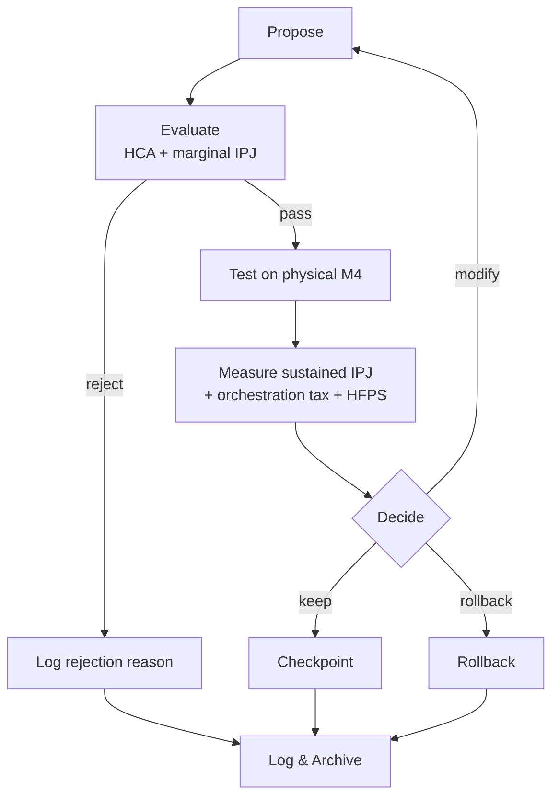

# Alalā Improvement Playbook

**Version**: 1.1  
**Purpose**: Define how self-improvement is performed, gated, and logged.

**IPJ authority**: All improvement IPJ claims use operational definitions in `IPJ_Measurement_Protocol_Alalā.md` §2.1 (Phase 0) and §2.4 E3 (meta-tax). No marginal IPJ without raw `powermetrics` + thermal logs per §2.5.

## Improvement Cycle

## Core Rules

1. **Improvement must be measurable**  
   Every proposed change must have a clear hypothesis about how it will improve IPJ or future capability.

2. **Positive marginal IPJ required**  
   A change is only kept if it produces positive **net** marginal IPJ per `IPJ_Measurement_Protocol_Alalā.md` §2.1, including meta-overhead per E3 (`energy_meta_total_joules` vs `energy_saved_subsequent_joules`). Run `harness/m4_energy_harness.py --mode meta_tax` before scaling any self-improvement cadence.

3. **HCA compliance is mandatory**  
   Every change must pass the HCA Impact Statement check. Changes that reduce human trust, autonomy, or flourishing are rejected.

4. **Changes are reversible by default**  
   All self-improvement modifications must be applied behind a checkpoint/rollback mechanism.

## Improvement Cycle

1. **Propose** — Identify a potential improvement (new prompt, new compiler pass, new memory layout, etc.).
2. **Evaluate** — Run the meta-controller (HCA + marginal IPJ check).
3. **Test** — Apply the change in a controlled experiment with full logging.
4. **Measure** — Compare sustained IPJ (thermal steady state), ANE utilization, orchestration tax, and HCA metrics before vs after on physical M4.
5. **Decide** — Keep, rollback, or modify based on results.
6. **Log & Archive** — Record the outcome for future learning.

## Logging Requirements

Every improvement attempt must log:
- Proposed change description
- HCA Impact Statement
- Estimated vs actual marginal IPJ
- Before/after metrics
- Final decision and reason

## Types of Allowed Improvements (Early Phases)

- Compiler pass improvements
- Prompt / reasoning strategy improvements
- Memory layout and access pattern improvements
- Scheduling / orchestration improvements

Changes that significantly increase model size or fundamentally alter the architecture require explicit human approval.

## Anti-Patterns

- Making changes without measurement
- Keeping changes that degrade IPJ or HCA
- Performing expensive self-improvement cycles with no clear path to net positive IPJ
- Ignoring thermal or SRAM constraints during improvement experiments

This playbook ensures self-improvement remains bounded, auditable, and aligned with the project's core invariants.
