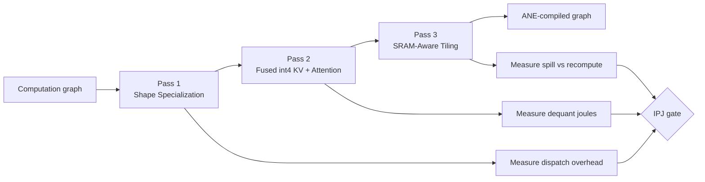

# Compiler Passes Skeleton — Alalā

**Version**: 1.1  
**Goal**: Define the first high-impact compiler passes that maximize ANE utilization and minimize unified-memory data movement on Mac Mini M4 24 GB.

**Note**: All "Expected Benefit" claims require Phase 0+ measured IPJ on physical M4 before production use.

## Compiler Pass Pipeline



## Design Principles

- Prefer static shape specialization over dynamic shapes when possible.
- Fuse operations aggressively to reduce memory traffic.
- Keep working sets inside the ~28–30 MB SRAM envelope when feasible.
- Make data movement and dispatch cost visible and measurable.

## Pass 1: Shape Specialization + Fixed-Shape Enforcement

**Goal**: Eliminate dynamic shape overhead and enable better ANE scheduling.

**Inputs**:
- Computation graph (from MLX or custom IR)
- Example input shapes from real workloads

**Outputs**:
- Specialized graph with all shapes fixed
- Shape guards for safety (optional in early versions)

**Pseudocode / Skeleton**:

```python
def shape_specialization_pass(graph, example_shapes):
    specialized = {}
    for node in graph.nodes:
        if node.op in ["matmul", "conv", "linear"]:
            shape = infer_shape(node, example_shapes)
            specialized[node] = create_fixed_shape_node(node, shape)
        else:
            specialized[node] = node
    return build_graph(specialized)
```

**Expected Benefit**: Better ANE utilization and reduced dispatch overhead.

## Pass 2: Fused Low-Precision KV + Attention

**Goal**: Reduce KV cache memory traffic using int4/int8 with efficient dequantization.

**Inputs**:
- Attention subgraph
- KV cache tensors (FP16 or BF16)

**Outputs**:
- Fused kernel that keeps KV in low precision and dequantizes on-the-fly (register or tile level)

**Pseudocode / Skeleton**:

```python
def fused_kv_attention_pass(attention_node):
    # Replace standard attention with fused low-precision version
    return create_fused_kv_attention(
        q=attention_node.q,
        k=attention_node.k,   # stored in int4
        v=attention_node.v,   # stored in int4
        dequant_mode="register"  # or "tile"
    )
```

**Expected Benefit**: Significant reduction in memory bandwidth pressure during decode.

## Pass 3: SRAM-Aware Tiling + Recomputation

**Goal**: Keep active working sets inside SRAM limits through tiling and selective recomputation.

**Inputs**:
- Layer or block graph
- SRAM budget (~28–30 MB)

**Outputs**:
- Tiled execution schedule with recomputation where beneficial

**Pseudocode / Skeleton**:

```python
def sram_aware_tiling_pass(graph, sram_budget_mb=28):
    tiles = partition_graph(graph, sram_budget_mb)
    schedule = []
    for tile in tiles:
        if tile.memory_footprint > sram_budget_mb:
            schedule.append(recompute_plan(tile))
        else:
            schedule.append(store_plan(tile))
    return schedule
```

## Integration Plan

These passes will be implemented incrementally in Phase 1 and Phase 2, with measurement gates after each major pass.

**Priority order**:
1. Shape Specialization (highest immediate impact)
2. Fused Low-Precision KV
3. SRAM-Aware Tiling + Recomputation
