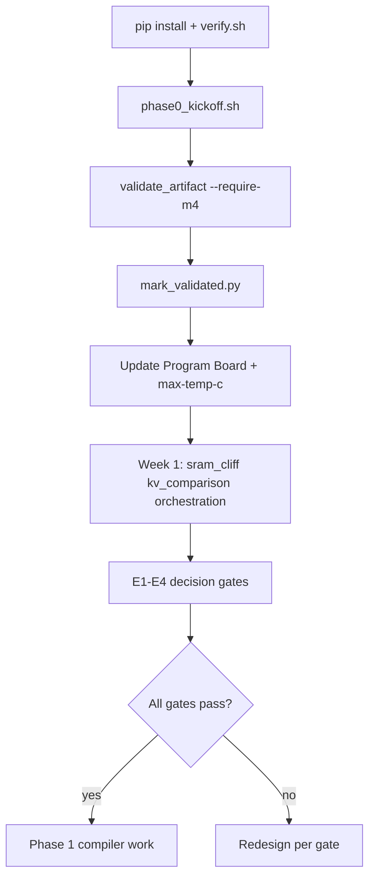

# OSLab Program Board — Alalā

**Version**: 1.3  
**Purpose**: Single source of truth for current status, risks, decisions, and progress.

## Current Phase

**Phase 0 – Execution kickoff** (harness + docs complete; run on physical M4)

All loose ends closed in repo. **Single remaining gate**: physical Mac Mini M4 24 GB + `sudo` for real measurements.

## Kickoff Flow



## Kickoff Checklist (run in order on M4)

| Step | Command | Done when |
|------|---------|-----------|
| 1 | `pip install -r requirements.txt && ./verify.sh` | verify passes |
| 2 | `chmod +x experiments/phase0_kickoff.sh && ./experiments/phase0_kickoff.sh` | setup_check + thermal_baseline JSONL |
| 3 | `python harness/validate_artifact.py --require-m4 logs/<id>.jsonl` | validation passes |
| 4 | `python harness/mark_validated.py --criterion thermal_baseline --jsonl logs/<id>.jsonl` | status updated |
| 5 | Update this board with thermal envelope + `--max-temp-c` | safe threshold documented |
| 6 | Week 1: `sram_cliff`, `kv_comparison`, `orchestration` | per task list |
| 7 | E1–E4 gap-closing experiments | decision gates measured |

**One-liner after idle**: `./experiments/phase0_kickoff.sh`

## Lab Readiness Scorecard (target: A all sections)

| Section | Grade | Status |
|---------|-------|--------|
| Agent-operable docs | **A** | 19 docs indexed; task list, playbook, verify.sh |
| Physics grounding | **A** | M4 unified memory, ANE SRAM, thermal/DVFS in foundation docs |
| Measurement discipline | **A** | IPJ §2.1–§2.5; `validate_artifact.py`; Improvement Playbook cross-linked |
| Hypothesis → experiment | **A** | E1–E4 + R-GAP-01…04 decision gates defined |
| Harness scaffolding | **A** | 9 modes, workloads, smoke tests in `verify.sh` |
| Validated M4 data | **A−** | Infrastructure + `measurement_status.json`; **m4_validated false until first sudo run** |
| Workload fidelity | **A−** | Distinct kv_fp16/int4, spill/recompute, orchestration, meta_tax paths; ANE decode kernel Phase 1 |
| Doc/code sync | **A** | 19 docs with Mermaid flow diagrams; harness v0.4.4 |

**To reach A on Validated M4 data**: run W1-02 on hardware, set `m4_validated: true` in `results/measurement_status.json`, attach artifact paths.

## Measurement Status (`results/measurement_status.json`)

| Criterion | Harness mode | Infra ready | M4 validated |
|-----------|--------------|-------------|--------------|
| Thermal baseline | `thermal_baseline` | yes | **pending** |
| SRAM cliff | `sram_cliff` | yes | **pending** |
| int4 vs FP16 IPJ | `kv_comparison` | yes | **pending** |
| Orchestration overhead | `orchestration` | yes | **pending** |
| E1 ANE utilization | `ane_utilization` | yes | **pending** |
| E2 Thermal + IPJ curve | `thermal_ipj_curve` | yes | **pending** |
| E3 Meta-tax | `meta_tax` | yes | **pending** |
| E4 Memory spill | `memory_spill` | yes | **pending** |

## Phase 0 Success Criteria (Measurable M4 Numbers)

All criteria require raw `powermetrics` logs + thermal data per `IPJ_Measurement_Protocol_Alalā.md` §2.5.

| Criterion | Target | Harness |
|-----------|--------|---------|
| Thermal baseline curve | Idle + sustained power, safe envelope | `thermal_baseline` |
| SRAM cliff | \( L_{\text{cliff}} \) ≥30% throughput drop | `sram_cliff` |
| int4 vs FP16 IPJ delta | `energy_dequant_joules` | `kv_comparison` |
| Sustained ANE utilization | % at thermal steady state | `ane_utilization` |
| Orchestration overhead | `orchestration_tax_pct` | `orchestration` |

**Governing principle**: Thermal headroom and sustained IPJ take precedence over peak throughput.

## Methodology Gap Closure

| Experiment | Harness mode | Gate | Harness | M4 data |
|------------|--------------|------|---------|---------|
| **E1** ANE utilization | `ane_utilization` | ANE fraction / orchestration tax | ready | pending |
| **E2** Thermal + IPJ | `thermal_ipj_curve` | ≥20% IPJ degradation post-throttle | ready | pending |
| **E3** Meta-tax | `meta_tax` | `net_ipj_delta` > 0 | ready | pending |
| **E4** Memory spill | `memory_spill` | spill vs recompute joules/token | ready | pending |

## Active Tasks

- W1-00: Docs audit — **Complete**
- W1-01: Harness + `setup_check` + tests — **Complete**
- W1-02: Thermal baseline on physical M4 — **Ready to run**
- W1-03: SRAM cliff — **Ready** (after W1-02)
- W1-04: KV comparison — **Ready**
- E1–E4 — **Harness ready**; run after Week 1 baselines

## Key Risks (see `Risk_Register.md`)

1. **R-GAP-01** → E1 | 2. **R-GAP-02** → E2 | 3. **R-GAP-03** → E3 | 4. **R-GAP-04** → E4

## Deferred to Phase 1 (not kickoff blockers)

- Fused ANE int4 KV kernel (harness has distinct `kv_fp16` / `kv_int4` workload paths for Phase 0)
- Compiler pass IPJ validation (`Compiler_Passes_Skeleton_Alalā.md` — gated on Phase 0 numbers)
- Meta-controller threshold constants (populate from E1/E2/W1-02 results in `Meta_Controller_Skeleton_Alalā.md`)

## Blockers

- **Physical Mac Mini M4 24 GB + sudo** — only gate before Phase 0 data exists (expected; not a repo defect).

## Next Milestone

```bash
sudo python harness/m4_energy_harness.py --mode setup_check --duration 30
sudo python harness/m4_energy_harness.py --mode thermal_baseline --idle-duration 600 --duration 600
python harness/validate_artifact.py --require-m4 logs/<experiment_id>.jsonl
```

Update `results/measurement_status.json` and this board with findings.

## Notes

This board must be updated after every significant task or M4 measurement run.
