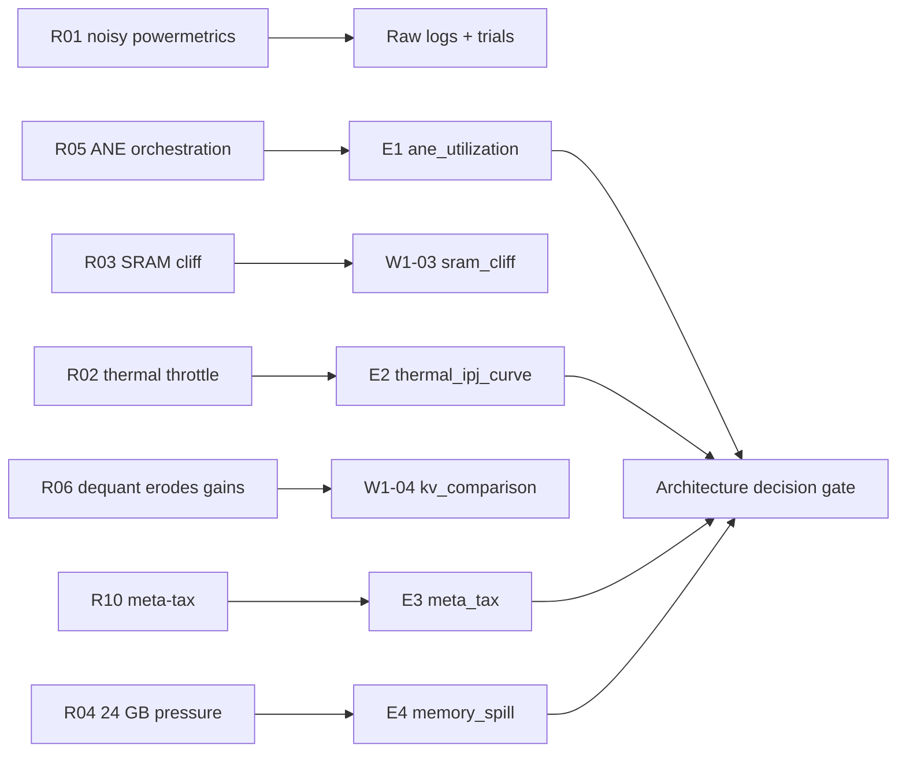

# Risk Register — Alalā

**Version**: 1.3  
**Purpose**: Track and manage risks across the project, with Phase 0 M4 measurement focus.

## Risk Scoring

- **Likelihood**: Low / Medium / High
- **Impact**: Low / Medium / High
- **Owner**: Who is responsible for monitoring/mitigation

## Guiding Principle (Phase 0+)

**Thermal headroom and sustained IPJ take precedence over peak throughput.** Risks that inflate peak benchmarks while degrading sustained useful work per joule are High impact.

## Risk → Experiment Mitigation Map

## Gap-Closing Risks (Decision Gates)

| ID | Risk | Mitigation | Status |
|----|------|------------|--------|
| **R-GAP-01** | **Low real ANE forward-pass coverage** — high orchestration and data-movement tax on unified memory | Execute **E1** (ANE utilization baseline) before any architecture decisions | Open – experiment defined |
| **R-GAP-02** | **Thermal throttling under sustained mixed load** — rapid loss of IPJ as thermal headroom shrinks | Execute **E2** (sustained thermal + IPJ degradation curve) | Open – experiment defined |
| **R-GAP-03** | **Self-improvement meta-tax exceeds marginal gains** — improvement loop consumes more energy than it saves | Execute **E3** (closed-loop meta-tax measurement); require net positive IPJ | Open – experiment defined |
| **R-GAP-04** | **Realistic working-set pressure and ANE SRAM spill cost** — 24 GB + KV cache + activations exceed comfortable residency | Execute **E4** (memory pressure & spill cost) | Open – experiment defined |

_See `Phase0_AI_Coder_Task_List.md` § Phase 0 Extended for experiment specs._

## Active Risks (as of 2026-06-30)

| ID | Risk | Likelihood | Impact | Owner | Mitigation / Notes | Status |
|----|------|------------|--------|-------|--------------------|--------|
| R01 | Noisy or unreliable `powermetrics` data | Medium | High | Grok Build | Multiple trials; attach raw logs to every result; cross-validate with external meter on calibration runs | Open |
| R02 | Thermal throttling under sustained ANE+CPU load | High | High | Grok Build | W1-02 thermal baseline; **see R-GAP-02 / E2** for sustained IPJ degradation gate | Open |
| R03 | SRAM cliff impact on long-context decode | High | High | Grok Build | W1-03 measure \( L_{\text{cliff}} \); **see R-GAP-04 / E4** for spill cost validation | Open |
| R04 | 24 GB working-set pressure (KV + activations + harness) | Medium | High | Grok Build | Budget unified memory; **see R-GAP-04 / E4** | Open |
| R05 | ANE utilization gaps due to orchestration | High | High | Grok Build | ANE-first default; **see R-GAP-01 / E1** before architecture decisions | Open |
| R06 | Dequantization energy eroding theoretical int4 gains | Medium | High | Grok Build | W1-04: log `energy_dequant_joules` vs FP16; reject config if IPJ delta ≤ 0 | Open |
| R07 | Grok Build underestimates low-level optimization difficulty | High | High | Human | Small gated tasks; frequent review in Phase 0 | Open |
| R08 | Documentation and code drift | Medium | Medium | Grok Build | Update docs after code changes; run `./verify.sh` before commit | Open |
| R09 | Over-optimism on ANE utilization gains | High | High | Team | **See R-GAP-01 / E1**; ground all claims in measured M4 numbers | Open |
| R10 | Self-improvement loop produces low-value or harmful changes | Medium | High | Meta-Controller + Human | HCA + marginal IPJ gates; **see R-GAP-03 / E3** for meta-tax gate | Open |

## Phase 0/1 Lab Uncertainties

**These risks are accepted lab uncertainties; we close them with physical M4 measurements before committing to model scale or self-improvement cadence.**

- **Measure first, redesign if marginal IPJ negative** — applies to R-GAP-01 … R-GAP-04, R03, R05, R06
- No IPJ claim without raw `powermetrics` + thermal data and thermal headroom statement (`IPJ_Measurement_Protocol_Alalā.md` §2.5)
- All benchmarks on physical Mac Mini M4 24 GB only; stop if temperature exceeds safe sustained threshold

## Closed / Mitigated Risks

None yet.

## Risk Review Cadence

- Review all open risks every Sunday.
- Add new risks as soon as they are identified.
- Escalate High/High risks to human immediately.
